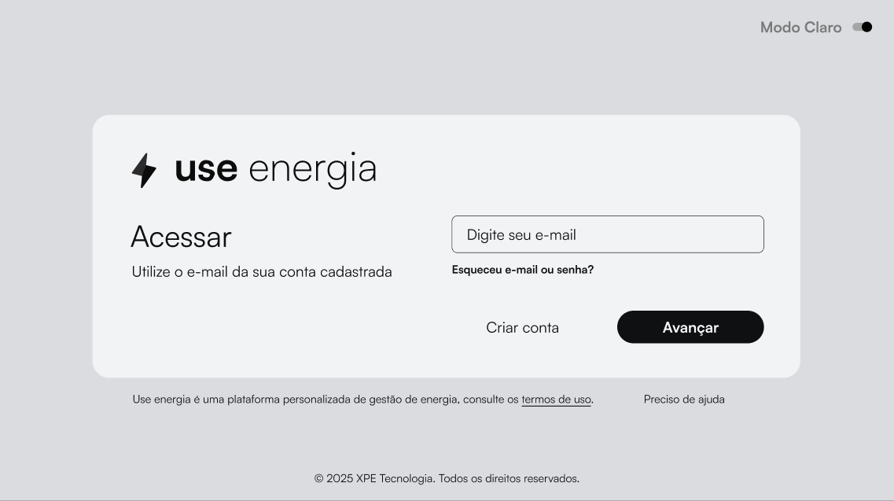
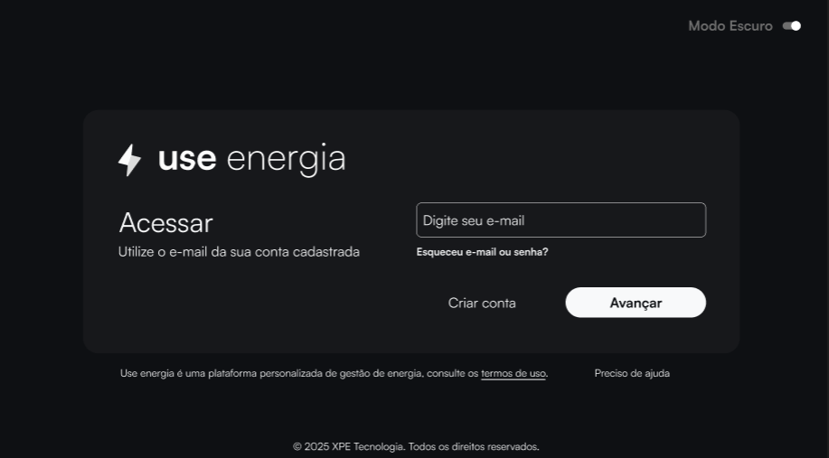

# GUIAS DO PROJETO | React + TypeScript + Vite

## MATÉRIAIS PARA CRIAR O PROJETO

### VÍDEOS:
- https://www.youtube.com/watch?v=AZyfp0tbGJ4&t=210s 
- https://www.youtube.com/watch?v=LQQ3CR2JTX8 
- https://www.youtube.com/watch?v=89NJdbYTgJ8
- https://www.youtube.com/@LucasSouzaDev/playlists 

### TECNOLOGIAS:
- React.js
- Vite
- TypeScript
- Figma
- ChatGPT
- BlackBox

### DOCUMENTOS:
- https://roadmap.sh/javascript
- https://roadmap.sh/react
- https://vite.dev/guide/

## FIGMA
 
 
